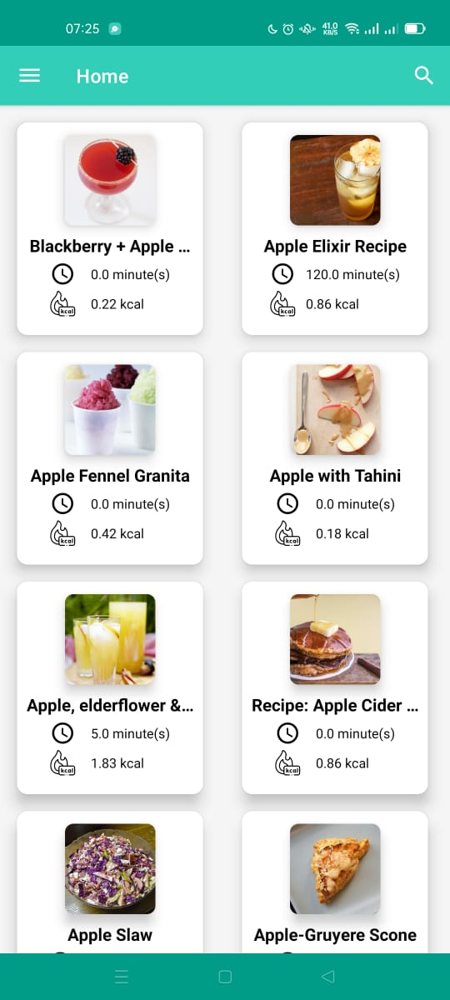
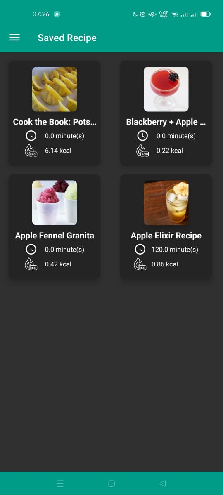
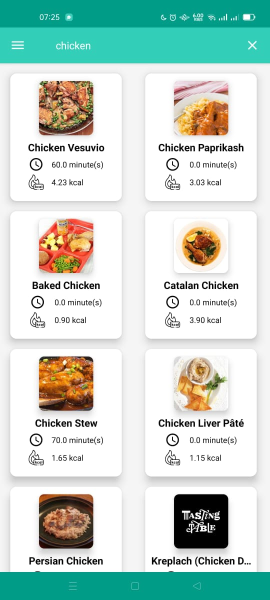
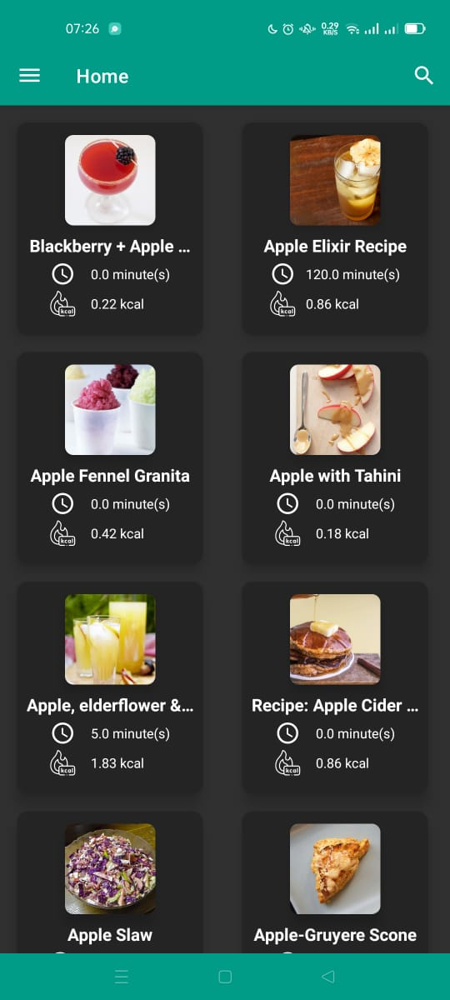
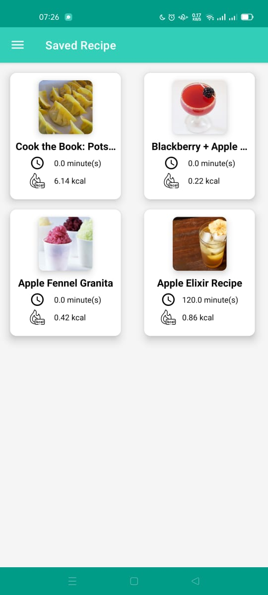
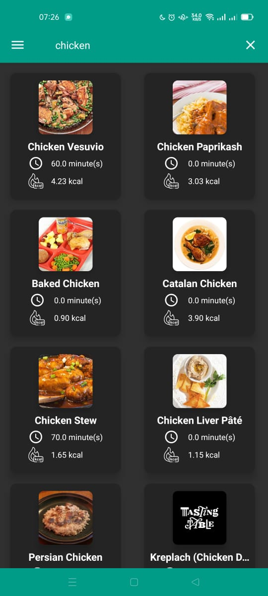
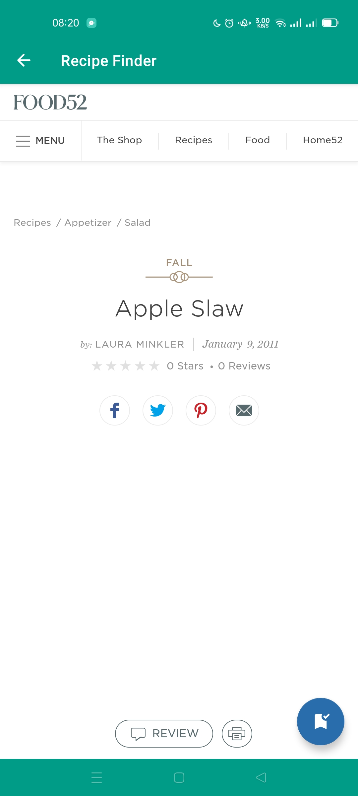
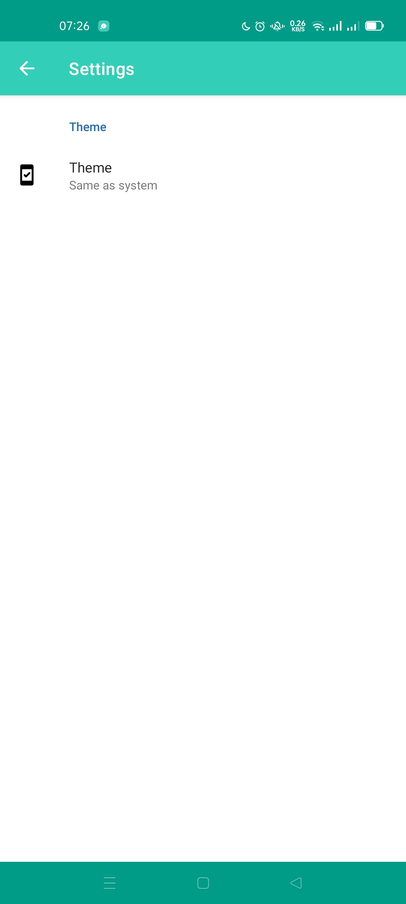
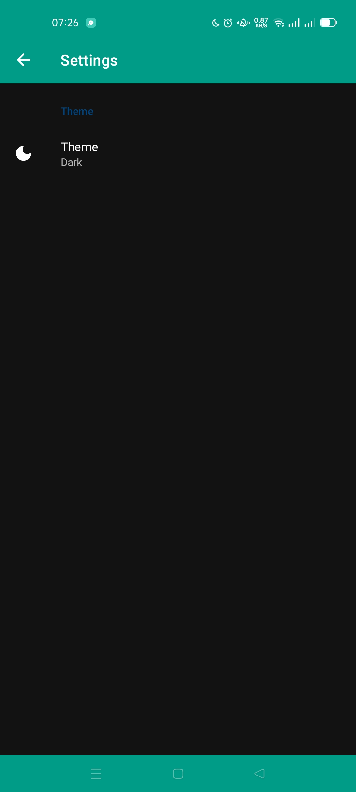

# Recipe Finder

A simple Android app to find online recipe. With this app you can:

* Search food recipes from thousands of recipe collections.
* View selected recipes.
* Save selected recipes.

## Display
### Splash Screen

### Home & Search
    
 

### Saved Recipes
 

### Recipe View

### Settings
 

## Library
* [Gson](https://github.com/google/gson/)
* [Retrofit](https://square.github.io/retrofit/)
* [Coroutine](https://developer.android.com/kotlin/coroutines)
* [Glide](https://github.com/bumptech/glide/)
* [Jetpack-Navigation](https://developer.android.com/guide/navigation/navigation-getting-started)
* [Room Persistence Library](https://developer.android.com/training/data-storage/room)

## API
* [Edamam Recipe Finder](https://developer.edamam.com/edamam-recipe-api)

## App Architecture
* MVVM
